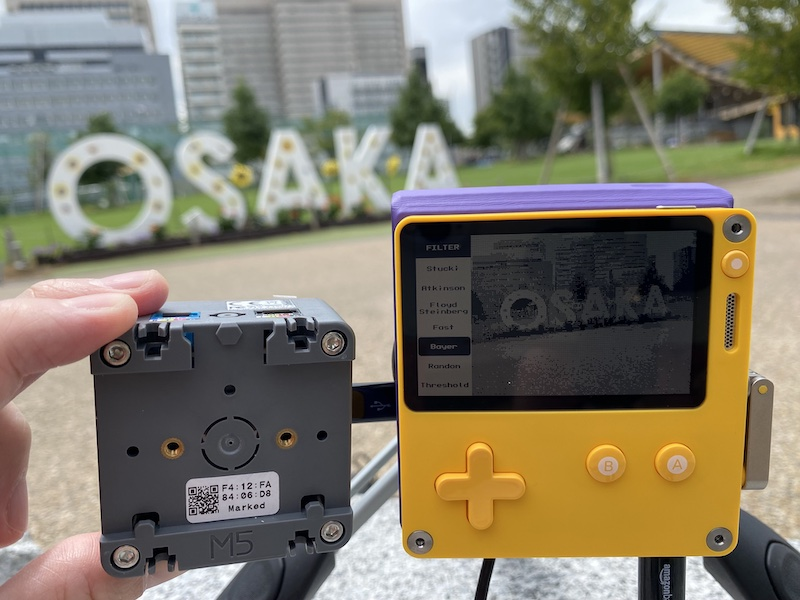

# PD-Camera for M5Stack

[日本語](./README-ja.md)

This project replaces the hardware part of the [PD-Camera project](https://github.com/t0mg/pd-camera) with M5Stack CoreS3 to make it work.

>PD-Camera is an unofficial, experimental accessory for [Panic Inc.](https://panic.com/)'s [Playdate](https://play.date) handheld console, which as the name hopefully suggests allows the device to record pictures as well as animated gifs, in whopping  1-bit color and QVGA (320x240) resolution. Kind of similar to the [1998 accessory for that other monochrome handheld device](https://en.wikipedia.org/wiki/Game_Boy_Camera) (which has 2-bit color and fewer pixels).
>
>-- <cite>[PD-Camera project](https://github.com/t0mg/pd-camera/tree/main#pd-camera-project)</cite>

For more information, see [PD-Camera project](https://github.com/t0mg/pd-camera).

## PD-Camera for M5Stack Features

- Install the companion app on Playdate and the PD-Camera for M5Stack firmware on M5Stack CoreS3. All that's left to do is connect via USB cable. It works amazingly easy!

- The M5Stack CoreS3 has a power supply and camera connected from the beginning, so no soldering or other steps are required.

- The PD-Camera for M5Stack is not available with a dedicated cover or case.

## Disclaimer

>This project is 
>- not affiliated with nor endorsed by [Panic Inc.](https://panic.com/), 
>- highly experimental,
>- very hacky,
>   - oh so hacky.
>
>While I crashed my own Playdate countless times working on this, and it has survived so far, I cannot be held responsible for any damage, data loss, bad selfie, pandemic, etc. that might occur to you while playing with this project. Use this at your own risk. Thanks ❤️.
>
>-- <cite>[PD-Camera project](https://github.com/t0mg/pd-camera/tree/main#disclaimer)</cite>

PD-Camera for M5Stack is very experimental as well. Enjoy at your own risk!

## Hardware

PD-Camera for M5Stack requires the following hardware.

- [Playdate](https://play.date)

- [M5Stack CoreS3](http://docs.m5stack.com/en/core/CoreS3)

- USB-C cable

## Companion app

The companion app that needs to be sideloaded into Playdate can be the [PD-Camera project App](https://github.com/t0mg/pd-camera-app) from the original project.

## Firmware

The latest firmware is uploaded to [M5Burner](https://docs.m5stack.com/en/download). Please use that for normal use.

## Building

This firmware is developed with [PlatformIO IDE for VSCode](https://marketplace.visualstudio.com/items?itemName=platformio.platformio-ide). Please read [PlatformIO IDE for VSCode](https://docs.platformio.org/en/stable/integration/ide/vscode.html) for detailed build instructions.

## Known issues

- As of v0.0.1, operation is unstable; USB communication may be interrupted, companion app and firmware may freeze or crash.

- Since data from USB communication may be missed in rare cases, there is a programmed workaround.

- [Known Issues](https://github.com/t0mg/pd-camera-app#known-issues) with the Companion App may be reproduced as well.

## Dependency Libraries

- [PD-Camera project](https://github.com/t0mg/pd-camera) by [t0mg](https://github.com/t0mg)

    Based on the source code from the PD-Camera project, I have created firmware that works with the M5Stack.

- [Template Repository for Generating User Custom Firmware for M5Burner v3](https://github.com/3110/m5burner-user-custom-platformio-template) by [SAITO, Tetsuya](https://github.com/3110) 

    The firmware was created for public use in [generate_user_custom.py](https://github.com/3110/m5burner-user-custom-platformio-template/blob/main/generate_user_custom.py).

- [dithering_halftoning](https://github.com/deeptronix/dithering_halftoning) by [deeptronix](https://github.com/deeptronix)

- [M5Unified](https://github.com/m5stack/M5Unified) by [lovyan03](https://github.com/lovyan03) 

- [ESP32TinyUSB](https://github.com/chegewara/EspTinyUSB) by [chegewara](https://github.com/chegewara)

- [esp32-camera](https://github.com/espressif/esp32-camera) by [Espressif Systems](https://github.com/espressif)

## Referenced Sites

- [playdate-reverse-engineering](https://github.com/jaames/playdate-reverse-engineering) by [jaames](https://github.com/jaames)

- [M5CoreS3_CameraTest](https://github.com/ronron-gh/M5CoreS3_CameraTest) by [motoh](https://github.com/ronron-gh)

- [esp32-usb-host-demos](https://github.com/touchgadget/esp32-usb-host-demos) by [touchgadget](https://github.com/touchgadget)

- [EspUsbHost](https://github.com/tanakamasayuki/EspUsbHost) by [TANAKA Masayuki](https://github.com/tanakamasayuki)

- [ESP32-S3 USB Hostの調査1](https://note.com/ndenki/n/n2bba54a9b3cc) by [えぬでんき](https://note.com/ndenki)

## Special Thanks

My sincere thanks to [t0mg](https://github.com/t0mg) for releasing the very nice and exciting [PD-Camera project](https://github.com/t0mg/pd-camera)!

----

 Playdate is © [Panic Inc.](https://panic.com/) - this project isn't affiliated with or endorsed by them in any way.
 